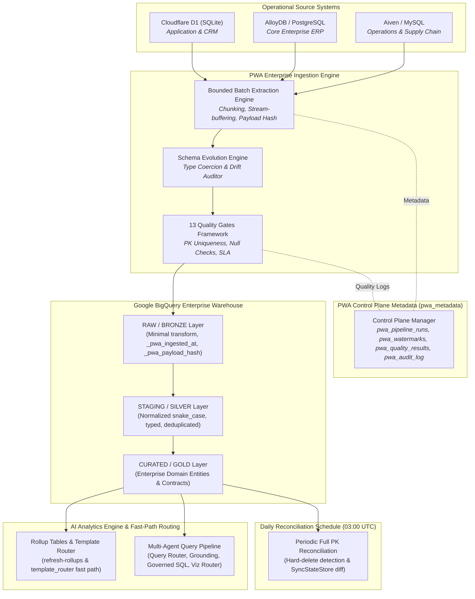

# Nexora Enterprise Platform — Polyglot Warehouse Agent (`pwa`)

> **Production Enterprise Data Integration, Heterogeneous Operational Source Environment, & BigQuery Data Foundation Platform**

[](https://www.python.org/)
[](https://cloud.google.com/bigquery)
[](LICENSE)

**Polyglot Warehouse Agent (`pwa`)** is a production-style enterprise data integration and warehouse foundation platform built for **Nexora Technologies** (an enterprise test environment). 

PWA integrates three heterogeneous operational source databases—**Cloudflare D1 (SQLite)**, **Google Cloud AlloyDB (PostgreSQL)**, and **Aiven MySQL (MySQL)**—plus multi-domain Kaggle source datasets into a centralized **Google BigQuery** enterprise warehouse platform across RAW, STAGING, and CURATED data layers.

---

## 📌 Project Milestones Status

| Milestone | Description | Status |
|---|---|---|
| **Phase 1A** | Source & Operational Data Foundation (Nexora Domain Migration, Kaggle Dataset Decoupling, Schema Registries) | **[IMPLEMENTED]** |
| **Phase 1B** | Enterprise Ingestion & BigQuery Data Foundation (Connectors, Extraction Engine, Control Plane, 13 Quality Gates, Watermarks, Schema Drift) | **[IMPLEMENTED]** |
| **Phase 1C** | Production Hardening & Enterprise Operations (Incremental Ingestion, Cloud Connectivity, SLA Freshness, Dead Letter Queue, Security Guardrails) | **[IMPLEMENTED]** |
| **Phase 2A** | Enterprise Semantic & Analytics Foundation (Catalog, Query Planning, Governed SQL Generator, Safety Validator, Ambiguity Model, Cost Guardrails) | **[IMPLEMENTED]** |
| **Phase 2B** | Multi-Agent Enterprise Analytics (Query Router, Semantic Grounding, Governed SQL Agent, Validation & Exec Agent, Answer Synthesis, Viz Router) | **[IMPLEMENTED]** |
| **Phase 2C** | Advanced Enterprise Analytics & Data Science Foundation (Analytical Workflows, Period Comparisons, Contribution, Cohorts, Retention, Funnels, Anomaly Detection, Feature Engineering) | **[IMPLEMENTED]** |

---

## 🏗️ Nexora Enterprise Data Architecture

The system architecture simulates a real-world enterprise operating multiple independent, domain-specific operational databases. Operational databases remain logically independent without cross-database foreign keys. Cross-system identity resolution and integration belong exclusively in the BigQuery warehouse.



---

## 📊 Operational Database Summary Matrix

| Database | Engine | Role | Key Domains | Source Datasets |
|---|---|---|---|---|
| **Cloudflare D1** | SQLite | Application / Operational | Organization, HR, CRM, Support, Marketing | AdventureWorks HR/Person, Olist Marketing Funnel |
| **Google Cloud AlloyDB** | PostgreSQL | Core Enterprise ERP | Sales Orders, Products, Customers, Returns, Marketplace | AdventureWorks Sales/Production, Olist E-Commerce |
| **Aiven MySQL** | MySQL | Operations & Supply Chain | Suppliers, Procurement, Warehousing, Inventory, Logistics | AdventureWorks Purchasing, Olist Sellers |

---

## 🏛️ BigQuery Warehouse Architecture

The BigQuery warehouse is structured into clear architectural layers:

```
BigQuery Project (salitsteel-502008)
├── nexora_raw / raw_*          # RAW / BRONZE Layer: Source-native tables with _pwa_* metadata headers
├── nexora_staging / staging_*  # STAGING / SILVER Layer: Snake_case, standardized data types, deduplicated
├── nexora_curated / curated_*  # CURATED / GOLD Layer: Enterprise domain models & contracts
└── pwa_metadata                # Control Plane Operational Metadata (no business data)
```

### 1. RAW / BRONZE Layer
- Preserves raw source records with minimal transformations.
- Required ingestion metadata appended to every raw table:
  - `_pwa_ingested_at` (TIMESTAMP)
  - `_pwa_run_id` (STRING)
  - `_pwa_source_system` (STRING)
  - `_pwa_source_table` (STRING)
  - `_pwa_payload_hash` (SHA-256 string excluding volatile headers)

### 2. STAGING / SILVER Layer
- Standardizes source data into reliable, typed warehouse structures.
- Applies deterministic `snake_case` column naming.
- Coerces timestamp, date, and numeric types.
- Deduplicates using stable identity keys (`source_system` + `source_table` + `source_primary_key`).

### 3. CURATED / GOLD Layer
- Trusted enterprise-facing entities (Customers, Products, Sales Orders, Purchase Orders, Suppliers, Inventory, Employees, Leads).
- Enforces strict contracts. Any entity lacking approved source data is explicitly marked `STRUCTURAL / UNPOPULATED` without fabricating artificial records.

### 4. PWA Metadata / Control Plane (`pwa_metadata`)
Stores operational pipeline telemetry across 8 core tables:
- `pwa_sources`
- `pwa_source_tables`
- `pwa_pipeline_runs`
- `pwa_task_execution`
- `pwa_watermarks`
- `pwa_schema_versions`
- `pwa_quality_results`
- `pwa_audit_log`

---

## 🛡️ Ingestion Engine & Operational Invariants

The ingestion system strictly enforces 15 mandatory enterprise data invariants:

1. **Watermark Advancement Invariant**: Watermarks advance ONLY IF extraction, transformation, quality checks, warehouse commit, and reconciliation all succeed.
2. **Payload Hash Determinism**: `_pwa_payload_hash` is generated via SHA-256 on deterministic JSON serialization of payload fields, ignoring volatile ingestion metadata.
3. **Idempotency**: Re-running ingestion never creates duplicate records.
4. **Schema Evolution Policy**:
   - New compatible columns: Allowed & logged.
   - Wider compatible data types: Allowed & logged.
   - Incompatible data types / Primary Key changes: Blocked & flagged in control plane.
5. **Phase 1 Quality Gates Framework (13 Gates)**:
   - Gate 1: Connectivity
   - Gate 2: Schema Discovery
   - Gate 3: Permission Audit
   - Gate 4: Extraction Boundary
   - Gate 5: Extraction Completeness
   - Gate 6: Type Coercion
   - Gate 7: PK Uniqueness
   - Gate 8: Null Constraint
   - Gate 9: Value Range
   - Gate 10: Standardized Transformation
   - Gate 11: Warehouse Commit
   - Gate 12: Source-Target Reconciliation
   - Gate 13: Freshness SLA
6. **Retry with Exponential Backoff + Jitter**: Transient network/database errors retry automatically; deterministic validation/schema errors fail fast.
7. **CDC Architecture Status**: Real-time CDC via GCP Datastream / Debezium was evaluated and explicitly deferred. Batch high-watermark extraction paired with periodic full PK set reconciliation satisfies all current freshness and consistency SLAs. CDC will be revisited only if a sub-minute streaming freshness SLA is introduced.

---

## ⚡ Quickstart & PWA CLI Commands

### 1. Installation

```bash
pip install -e ".[dev]"
```

### 2. Configuration & Validation

```bash
# Validate settings and configuration without leaking credentials
python -m pwa.cli config validate
```

### 3. Operational Source Operations

```bash
# List all registered operational sources
python -m pwa.cli source list

# Inspect source configuration & local database connectivity
python -m pwa.cli source inspect d1
python -m pwa.cli source inspect alloydb
python -m pwa.cli source inspect aiven

# Discover schemas and row counts in source databases
python -m pwa.cli source discover d1
python -m pwa.cli source discover alloydb
python -m pwa.cli source discover aiven

# Test connectivity to operational sources
python -m pwa.cli source test d1
```

### 4. Ingestion & Quality Operations

```bash
# Ingest single source into BigQuery RAW/STAGING/CURATED
python -m pwa.cli ingest run d1

# Ingest all operational sources
python -m pwa.cli ingest run --all

# Check control plane run status
python -m pwa.cli ingest status

# Run 13 quality gates for a source
python -m pwa.cli quality run d1

# Validate BigQuery warehouse pipeline
python -m pwa.cli warehouse validate

# Audit control plane logs
python -m pwa.cli audit --days 7
```

### 5. Enterprise Semantic & Analytics CLI (Phase 2A)

```bash
# Validate semantic catalog schema and division-by-zero integrity
python -m pwa.cli semantic validate

# List all registered enterprise semantic entities & physical tables
python -m pwa.cli semantic list

# Inspect metrics catalog and division-by-zero NULLIF formulas
python -m pwa.cli semantic metrics

# Display governed join graph relationships
python -m pwa.cli semantic relationships

# Inspect detailed metadata, primary keys, and grain of a specific entity
python -m pwa.cli semantic inspect fact_sales_order

# Trace lineage from metric -> curated -> staging -> raw -> source
python -m pwa.cli semantic lineage revenue
```

### 6. Multi-Agent Enterprise Analytics CLI (Phase 2B)

```bash
# Ask natural language questions via multi-agent analytical pipeline
python -m pwa.cli ask "Show monthly revenue by category"

# Generate semantic query plan for a question
python -m pwa.cli query plan "Show revenue by product category"

# Produce full query explanation (intent, entities, dimensions, metrics, SQL, cost, validation status)
python -m pwa.cli query explain "Show revenue by category"

# Validate query end-to-end without full execution
python -m pwa.cli query validate "Show monthly revenue"
```

### 7. Advanced Enterprise Analytics CLI (Phase 2C)

```bash
# Display multi-step analytical workflow breakdown and cost guardrails
python -m pwa.cli analyze explain "Why did revenue change?"

# Execute multi-step diagnostic, period comparison, or contribution workflow
python -m pwa.cli ask "Show revenue growth year over year"
python -m pwa.cli ask "Which categories contributed most to revenue growth?"
python -m pwa.cli ask "Show customer retention by cohort"
python -m pwa.cli ask "Show the customer funnel"
python -m pwa.cli ask "Find unusual revenue movements"
```

---

## 🧪 Testing & Local Development

The test suite runs 100% offline without requiring active GCP cloud credentials by utilizing the mock adapter mode in `BigQueryWriter` and local SQLite representations for operational databases.

```bash
# Run complete test suite (185+ tests passing)
python -m pytest
```

Key integration tests include:
- Watermark non-advancement on extraction failure
- Watermark non-advancement on quality gate failure
- Watermark non-advancement on warehouse commit failure
- Payload hash determinism & change detection
- Ingestion idempotency across repeated runs
- Schema drift policy enforcement (blocking incompatible changes)
- Source-target row count reconciliation mismatch detection
- Security audit ensuring secrets never leak to logs

---

## 🔒 Security & Provenance

- **Secret Redaction**: Passwords, API keys, and connection strings are masked in logs and CLI outputs.
- **Kaggle Source Provenance**: Kaggle source datasets (AdventureWorks 2022, Olist E-Commerce, Olist Marketing Funnel) preserve full origin metadata in `docs/data/source-provenance.md`.

---

## 📚 Documentation Directory

- [Database Allocation Matrix](docs/data/database-allocation.md) — Table allocation, primary keys, FKs, and synthetic flags
- [Operational Relationship Map](docs/data/relationship-map.md) — ERD diagrams and cross-database decoupling standards
- [Source Provenance Standard](docs/data/source-provenance.md) — Provenance tracking standard
- [Data Profiling Report](docs/data/data-profiling.md) — Column null rates and distinct counts
- [Database Setup & Credential Guide](docs/data/database-setup.md) — Connection configuration and environment variables
- [BigQuery Warehouse Guide](docs/bigquery.md) — Warehouse layout and security controls

---

## 📜 License

Distributed under the [MIT License](LICENSE).