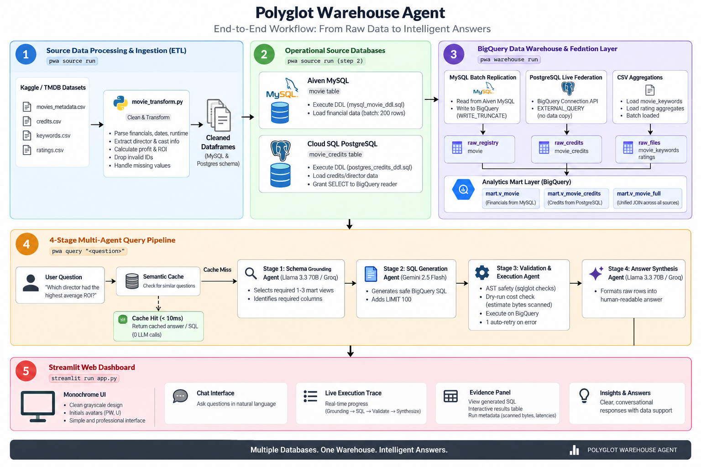
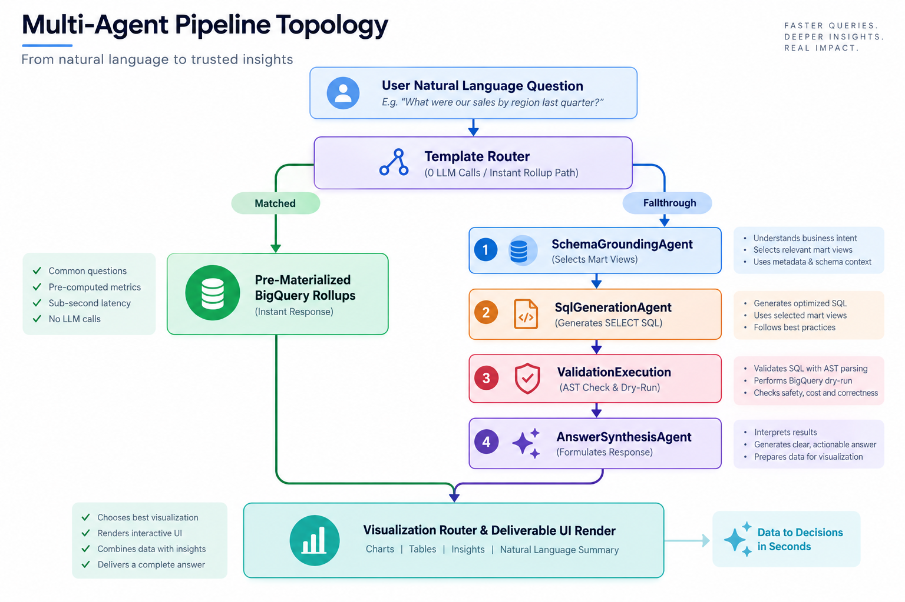

# Polyglot Warehouse Agent (`pwa`)

> **Production Cross-Engine Data Warehouse & Federated Multi-Agent NLP Analytics Platform**

[](https://www.python.org/)
[](https://github.com/google/adk)
[](https://cloud.google.com/bigquery)
[](https://streamlit.io/)
[](LICENSE)

**Polyglot Warehouse Agent (`pwa`)** is an enterprise-grade data engineering pipeline and natural language analytical agent platform. It unifies heterogeneous transactional databases (**Aiven MySQL** for financials, **Cloud SQL PostgreSQL** for cast & credits) and raw batch datasets into a centralized **Google BigQuery** federated data warehouse, backed by a **4-agent Google ADK framework** with interactive Streamlit deliverable reporting.

---

## 📐 System Architecture & Workflow



---

## ✨ Key Platform Capabilities

- 🔀 **Cross-Engine Federated Analytics**: Queries across **Aiven MySQL** (financial metrics), **Cloud SQL PostgreSQL** (cast & credit data), and **Google BigQuery** using BigQuery `EXTERNAL_QUERY` federation with Zero-ETL speed.
- 🤖 **4-Agent ADK Query Pipeline**: Decomposes natural language questions into an automated 4-agent workflow (**Schema Grounding** → **AST SQL Generation** → **Dry-Run Validation** → **Answer Synthesis**).
- ⚡ **Zero-LLM Fast-Path Rollup Router**: Instant analytical response (<0.05s) for standard rollup queries (`avg_roi_by_director`, `avg_cast_size_by_threshold`, `top_grossing_movies`, `avg_roi_by_genre`) bypassing LLM latency.
- 📊 **Dynamic Visualization Router**: Shape-heuristic router that automatically selects and renders `st.metric` (1 row), `st.bar_chart` (categoricals), `st.line_chart` (time-series), or `st.dataframe` (tables) with instant client-side alternative switcher.
- 🛑 **Production Cost & Safety Guardrails**: Pre-execution AST read-only verification, 100 MB dry-run cost scanning, zero-division ROI budget bounds, and 1:N keyword deduplication.
- 📄 **Analytical Report Deliverables**: Shareable, reproducible report views complete with data provenance badges, applied guardrails, Markdown export, and one-click PDF generation.

---

## 🚀 Quickstart

### 1. Installation

```bash
pip install -e ".[dev]"
```

### 2. Configuration & Credentials

Copy `.env.example` to `.env` and configure your cloud credentials and service endpoints:

```bash
cp .env.example .env
```

Place the Aiven TLS service certificate at `certs/ca.pem` (Aiven Console → MySQL Service → Overview → CA Certificate). Validation strictly requires verified TLS connections.

### 3. Validate Configuration & Audit Warehouse

```bash
# Validate settings, environment variables, and database connection strings
pwa config

# Run read-only inventory audit and cross-engine data reconciliation
pwa audit
```

### 4. Execute ETL & Warehouse Pipelines

```bash
# Run Source Pipeline (Kaggle download -> Clean -> Load MySQL & Postgres -> Verification Gates 1-13)
pwa source run

# Run Warehouse Pipeline (BigQuery setup -> Land data -> Build Mart Views -> Gates B1-B15)
pwa warehouse run

# Or run complete end-to-end pipeline
pwa all
```

---

## 🤖 NLP Analytical Agent (`pwa query`) & Streamlit UI

Execute natural language questions against the BigQuery mart either via the command-line CLI or the Streamlit web interface.

### Streamlit Web Interface

```bash
streamlit run app.py
```

- **Monochrome Command Design**: Sleek, high-contrast dark design system (`Public Sans`, `Fraunces`, `JetBrains Mono`).
- **Live Stage Tracker**: Real-time multi-agent execution pipeline state updates.
- **Evidence Panel**: Expandable generated SQL, execution latency, scanned bytes, and full raw results table.
- **Instant Alternative Chart Switcher**: Client-side chart type switching without query re-execution.

### Command-Line CLI

```bash
# Single-shot query
pwa query "Which director has the highest average ROI across their movies?"

# Interactive REPL mode
pwa query --interactive

# Specify custom backend model with debug logging
pwa query --model groq --verbose "What is the average cast size for movies over 500M revenue?"
```

---

## 🏛️ Multi-Agent Pipeline Topology




1. **`SchemaGroundingAgent`** (`schema_agent.py`): Maps natural language questions to `INFORMATION_SCHEMA` metadata, selecting only required mart views and columns.
2. **`SqlGenerationAgent`** (`sql_agent.py`): Produces standard BigQuery `SELECT` queries with enforced column selection and strict `LIMIT` bounds.
3. **`ValidationExecutionAgent`** (`exec_agent.py`): Performs AST-level read-only checks, verifies cost against 100 MB dry-run limit, executes against BigQuery, and handles 1 automatic error retry.
4. **`AnswerSynthesisAgent`** (`answer_agent.py`): Synthesizes natural language answers and injects structured visualization recommendations.

---

## 🛠️ CLI Command Reference

| Command | Description |
|---|---|
| `pwa config` | Validates environment, credentials, and outputs redacted configuration |
| `pwa audit` | Performs read-only inventory, connectivity tests, and cross-store record reconciliation |
| `pwa audit --apply` | Executes automated cleanup of classified stale temporary paths |
| `pwa source run` | Downloads Kaggle dataset, transforms schema, loads MySQL & Postgres, runs Gates 1-13 |
| `pwa warehouse run` | Initializes BigQuery datasets, lands federated tables, builds mart views, runs Gates B1-B15 |
| `pwa all` | Executes complete end-to-end source + warehouse pipeline sequence |
| `pwa query "<question>"` | Runs single-shot NLP query against warehouse using 4-agent pipeline |
| `pwa query --interactive` | Launches interactive CLI REPL session for conversational querying |

---

## 🔬 Benchmark Analytical Questions

```bash
# Single-Table Financial Metric (MySQL Replicated)
pwa query "Which movie had the highest revenue in 2010?"

# Cross-Engine Financials × Credits Join (MySQL × Cloud SQL PostgreSQL)
pwa query "Which director has the highest average ROI across their movies?"

# Revenue Threshold Rollup Query
pwa query "What is the average cast size for movies that earned over 500 million dollars?"

# Keyword & 1:N Deduplicated Search (CSV Batch Load)
pwa query "Find all movies tagged with the keyword 'space travel' and show their ratings."
```

---

## 📊 Cross-Engine Queries & Automated Visualizations

The platform automatically translates cross-engine questions joining **Aiven MySQL** (`mart.v_movie`) and **Cloud SQL PostgreSQL** (`mart.v_movie_credits`) into interactive chart visualizations in Streamlit (`app.py`) and CLI (`pwa query`):

| Visualization Type | Example Natural Language Question | Description & Cross-Engine Join |
| :--- | :--- | :--- |
| **📊 Bar Chart** | `"Which director has the highest average ROI across their movies?"` | Director ROI ranking (MySQL financials $\times$ PostgreSQL credits) |
| **📊 Bar Chart** | `"Show top 10 lead actors by total box office revenue"` | Lead actor revenue rollup (MySQL revenue $\times$ PostgreSQL cast) |
| **📈 Line Chart** | `"Show the average cast size by release year over time"` | Time-series trend of cast size over release years |
| **🔵 Scatter Plot** | `"Compare budget versus revenue for action movies with cast size over 15"` | Budget vs Revenue correlation plot filtered by cast size |
| **🔢 Metric Card** | `"What is the average cast size for movies that earned over 500 million dollars?"` | Single aggregate metric calculation over revenue threshold |
 


---

## 📚 Technical Documentation & Deep Dives

- [Architecture & Design Guide](docs/architecture.md) — System topology, cross-engine federation strategy, and schema design
- [BigQuery Warehouse Guide](docs/bigquery.md) — Warehouse layout, mart views, connection resources, and security
- [Operations & Runbook](docs/runbook.md) — Operations runbook, troubleshooting guides, and credentials setup
- [Audit & Verification Report](docs/audit_report.md) — Full data reconciliation results, record counts, and quality gates

---

## 📜 License

Distributed under the [MIT License](LICENSE).