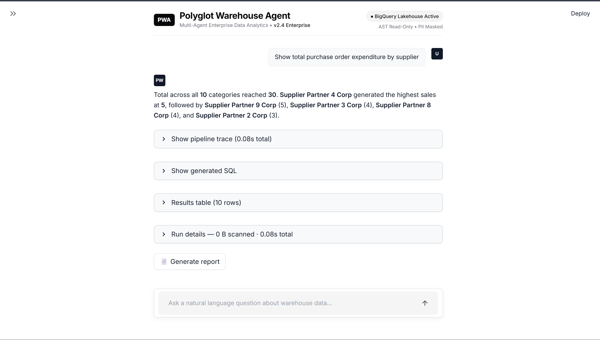
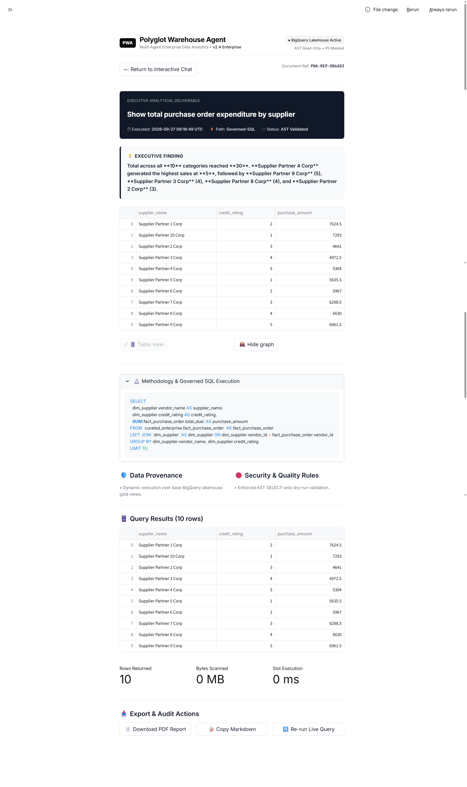
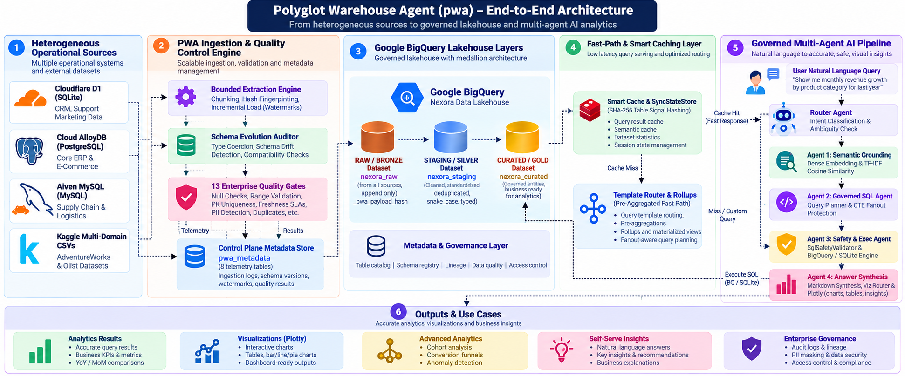

# ⚡ Polyglot Warehouse Agent (`pwa`) — Nexora Enterprise Platform

> **State-of-the-Art Multi-Agent AI Data Engineering & Heterogeneous Lakehouse Analytics Platform**

<div align="center">

<!-- Core Stack -->


<!-- Data Sources -->


</div>

---

## 💡 Executive Summary at a Glance

**Polyglot Warehouse Agent (`pwa`)** is an enterprise-grade data integration, warehouse automation, and multi-agent AI analytics system built for **Nexora Technologies**. 

It unifies **3 heterogeneous operational source engines** (Cloudflare D1 SQLite, Cloud AlloyDB PostgreSQL, and Aiven MySQL) and Kaggle enterprise datasets into a **Google BigQuery Data Lakehouse** (Bronze/Silver/Gold/Metadata). On top of this governed data foundation sits a **governed 4-Agent AI analytics engine** capable of translating natural language questions into accurate, fanout-safe SQL, executing offline against local SQLite mirrors or live in BigQuery, and rendering automated visualization recommendations.

---

## 🖥️ Platform Interface Showcase

### 💬 Governed AI Conversational Chat Interface


### 📄 Executive Analytical Deliverable Report View


---

## 📐 End-to-End System Architecture

The diagram below details the entire end-to-end flow from source extraction through data lakehouse layering to multi-agent query execution and analytics visualization.



---

## 🗄️ Database Allocation & Domain Matrix

To mirror realistic enterprise systems, operational databases are logically decoupled with zero cross-database foreign keys. Identity resolution happens exclusively within BigQuery.

| Source Engine | Technology | Business Domain | Key Tables / Entities | Source Datasets |
| :--- | :--- | :--- | :--- | :--- |
| **Cloudflare D1** | SQLite | Application & HR / CRM | Organization, Employees, Departments, Marketing Leads | AdventureWorks HR/Person, Olist Marketing Funnel |
| **Cloud AlloyDB** | PostgreSQL | Core Enterprise ERP | Sales Orders, Order Items, Customers, Products, Categories | AdventureWorks Sales/Production, Olist E-Commerce |
| **Aiven MySQL** | MySQL | Operations & Supply Chain | Suppliers, Vendors, Purchase Orders, PO Items, Inventory | AdventureWorks Purchasing, Olist Sellers |

---

## 🏛️ BigQuery Warehouse Layering Architecture

```
salitsteel-502008 (BigQuery GCP Project)
├── 📦 nexora_raw / raw_*          ➜ BRONZE: Source-native schema + _pwa_* metadata headers
├── 📦 nexora_staging / staging_*  ➜ SILVER: Snake_case, standardized datatypes, PK deduplicated
├── 📦 nexora_curated / curated_*  ➜ GOLD: Enterprise domain models, governed contracts, views
└── ⚙️ pwa_metadata                ➜ CONTROL PLANE: Operational telemetry & audit logs
```


### 1. RAW / BRONZE (`nexora_raw`)
Append-only raw tables preserving exact source payloads alongside standardized lineage headers:
- `_pwa_ingested_at` (`TIMESTAMP`): UTC ingestion timestamp
- `_pwa_run_id` (`STRING`): Unique pipeline execution UUID
- `_pwa_source_system` (`STRING`): Identifier (`d1`, `alloydb`, `aiven`)
- `_pwa_source_table` (`STRING`): Original source table name
- `_pwa_payload_hash` (`STRING`): SHA-256 fingerprint of row content excluding volatile metadata

### 2. STAGING / SILVER (`nexora_staging`)
Lightly transformed, clean tables:
- Standardized `snake_case` column naming
- Type coercion (ISO timestamps, numeric precision, explicit booleans)
- Deduplication via identity key (`_pwa_source_system` + `_pwa_source_table` + `primary_key`)

### 3. CURATED / GOLD (`nexora_curated`)
Governed, enterprise analytics domain entities:
- `fact_sales_order`, `fact_sales_order_item`
- `fact_purchase_order`, `fact_purchase_order_item`
- `dim_customer`, `dim_product`, `dim_supplier`, `dim_employee`, `dim_department`
- `fact_marketplace_order`, `fact_closed_deal`, `fact_marketing_lead`

### 4. Control Plane Metadata (`pwa_metadata`)
Operational telemetry recorded across 8 internal tracking tables:
`pwa_sources`, `pwa_source_tables`, `pwa_pipeline_runs`, `pwa_task_execution`, `pwa_watermarks`, `pwa_schema_versions`, `pwa_quality_results`, `pwa_audit_log`.

---

## 🤖 Governed Multi-Agent AI Analytics Pipeline

When a user asks a natural language question (e.g. *"Show monthly revenue by product category"*), PWA routes the request through a 4-agent orchestration workflow:


### Agent Detailed Breakdown

#### 🔍 Agent 1: Semantic Grounding Agent (`schema_agent.py`)
- Maps natural language phrases to governed entities, dimensions, and measures in `catalog.yaml`.
- Uses a **hybrid dense-lexical vector matching engine**:
  - Dense embedding similarity via GCP Vertex / LiteLLM embeddings.
  - Fallback TF-IDF word + character 3-gram vector similarity (`defaultdict(float)` weighted cosine similarity).
- Evaluates ambiguity via `AmbiguityModel`. If terms are ambiguous, requests explicit user clarification.

#### ⚙️ Agent 2: Governed SQL Agent (`sql_agent.py` & `query_planner.py`)
- Converts `GroundedIntent` into a structured physical `QueryPlan`.
- **Fanout & Grain Protection**: Detects grain mismatches across 1:N or N:M joins. If fanout risk is detected, automatically compiles a **CTE subquery pre-aggregated SQL** statement to prevent row multiplication before joining.

#### 🛡️ Agent 3: Execution & Safety Agent (`exec_agent.py`)
- Enforces read-only safety via `SqlSafetyValidator` (blocks `INSERT`, `UPDATE`, `DROP`, `DELETE`, and direct `nexora_raw` access).
- Supports dual execution backends:
  - **Live BigQuery**: Authenticated cloud execution with dry-run byte cost estimation.
  - **Local SQLite Engine (`local_engine.py`)**: 100% offline in-memory execution using loaded CSV source snapshots.

#### 📊 Agent 4: Answer Synthesis & Viz Router (`answer_agent.py` & `viz_router.py`)
- Synthesizes clear markdown summary answers with executive insights.
- Evaluates dataframe shape, data types, and cardinality to select optimal Plotly visualizations (Bar charts, Line trends, Scatter plots, Donut charts, Metrics cards).
- Provides complete evidence panels and rejection explanations when queries cannot be answered safely.

---

## 🛡️ Enterprise Data Quality & Security Guardrails

### 1. 13 Enterprise Quality Gates (`gates_source.py`)
Every batch extraction must pass 13 automated quality checks before committing watermarks:
1. **Connectivity**: Source database connection health.
2. **Schema Discovery**: Verification of expected tables and columns.
3. **Permission Audit**: Read access privileges.
4. **Extraction Boundary**: High-watermark lower/upper timestamp boundary sanity checks.
5. **Extraction Completeness**: Row count extraction verification.
6. **Type Coercion**: Data type conversion validation.
7. **PK Uniqueness**: Zero primary key duplicate tolerance.
8. **Null Constraint**: Non-null checks on critical keys.
9. **Value Range**: Numeric & date sanity range checks.
10. **Standardized Transformation**: Snake_case & metadata header injection check.
11. **Warehouse Commit**: Successful BigQuery transaction validation.
12. **Source-Target Reconciliation**: Source vs. target row count & aggregate sum validation.
13. **Freshness SLA**: Data freshness threshold verification.

### 2. PII Governance & Data Masking (`pii.py`)
- Classifies PII columns (`email`, `phone`, `ssn`, `first_name`, `last_name`, `address`).
- Integrates with GCP Cloud DLP (`inspect_content_pii`) for unstructured text scanning.
- Applies BigQuery column policy tags via DDL (`ALTER TABLE ... SET OPTIONS (policy_tags=[...])`).
- Automatically masks sensitive DataFrames (`mask_dataframe_pii`) before returning data to UI or exports.

---

## 🚀 Quickstart Guide

### 1. Requirements & Installation

```bash
# Clone Repository
git clone https://github.com/Dakshin10/polyglot-warehouse-agent.git
cd polyglot-warehouse-agent

# Install dependencies in editable mode
pip install -e ".[dev]"
```

### 2. Configuration Setup

Copy `.env.example` to `.env` and configure credentials:

```bash
cp .env.example .env
```

Validate project setup and environment configuration:

```bash
python -m pwa.cli config validate
```

---

## 💻 Command Line Interface (CLI) Reference

The `pwa` CLI exposes complete management commands across all platform capabilities:

```bash
# =====================================================================
# 1. SOURCE OPERATIONS
# =====================================================================
python -m pwa.cli source list             # List registered sources
python -m pwa.cli source inspect d1       # Inspect source connection & config
python -m pwa.cli source discover alloydb # Discover tables & schema
python -m pwa.cli source test aiven       # Test source connectivity

# =====================================================================
# 2. INGESTION & QUALITY GATES
# =====================================================================
python -m pwa.cli ingest run d1           # Ingest specific source into BigQuery
python -m pwa.cli ingest run --all        # Ingest all sources
python -m pwa.cli ingest status           # Inspect control plane run status
python -m pwa.cli quality run d1          # Run 13 quality gates
python -m pwa.cli warehouse validate      # Validate BigQuery lakehouse tables

# =====================================================================
# 3. ENTERPRISE SEMANTIC LAYER
# =====================================================================
python -m pwa.cli semantic validate       # Validate catalog YAML & formula integrity
python -m pwa.cli semantic list           # List entities & physical tables
python -m pwa.cli semantic metrics        # Inspect metrics & NULLIF formulas
python -m pwa.cli semantic relationships  # Display governed join graph
python -m pwa.cli semantic lineage revenue# Trace metric lineage back to source

# =====================================================================
# 4. MULTI-AGENT AI ANALYTICS
# =====================================================================
python -m pwa.cli ask "Show monthly revenue by category"
python -m pwa.cli query plan "Show top 5 customers by sales"
python -m pwa.cli query explain "Show total expenditure by vendor"

# =====================================================================
# 5. ADVANCED ANALYTICS & DIAGNOSTICS (Phase 2C)
# =====================================================================
python -m pwa.cli ask "Show revenue growth year over year"
python -m pwa.cli ask "Which categories contributed most to revenue growth?"
python -m pwa.cli ask "Show customer retention by cohort"
python -m pwa.cli ask "Show the customer funnel"
python -m pwa.cli ask "Find unusual revenue movements"
```

---

## 🧪 Comprehensive Offline Testing

The test suite runs **100% offline** without needing GCP cloud credentials by using mock BigQuery adapters and local SQLite in-memory databases.

```bash
# Run pytest test suite (419 tests passing)
python -m pytest
```

```
================================ test session summary ================================
collected 432 items / 9 deselected / 1 skipped / 423 selected

tests\integration\test_cloud_integration.py sss                                [  0%]
tests\test_alerting.py .......                                                 [  2%]
tests\test_ast_sql_validation.py ........................                      [  8%]
tests\test_audit_remediation.py ..................                             [ 12%]
tests\test_auth.py ..........                                                  [ 14%]
tests\test_connector_coverage.py ............................................. [ 37%]
tests\test_embedding_production.py .........                                   [ 41%]
tests\test_fanout_correctness.py ...                                           [ 43%]
tests\test_guardrails.py .....                                                 [ 45%]
tests\test_phase2a_semantic.py ..........                                      [ 58%]
tests\test_phase2b_multi_agent.py ............                                 [ 60%]
tests\test_phase2c_advanced_analytics.py ............                          [ 63%]
tests\test_viz_recommendation.py .....................................         [ 94%]
tests\test_viz_router.py ...................                                   [ 99%]
tests\test_zero_overlap_matching.py ...                                        [100%]

==================== 419 passed, 5 skipped, 9 deselected in 72.79s ====================
```

---

## 📁 Repository Directory Structure

```
polyglot-warehouse-agent/
├── catalog_drafts/             # Auto-generated draft catalog YAML scaffolds
├── docs/                       # Architecture, Database Allocations & ERD Docs
│   ├── bigquery.md
│   └── data/
│       ├── database-allocation.md
│       ├── data-profiling.md
│       ├── database-setup.md
│       ├── relationship-map.md
│       └── source-provenance.md
├── src/
│   └── pwa/
│       ├── agent/              # Multi-Agent Orchestration & Pipeline
│       │   ├── pipeline/       # Agent 1 (Schema), Agent 2 (SQL), Agent 3 (Exec), Agent 4 (Answer)
│       │   ├── guardrails.py   # Cost & Safety Guardrails
│       │   ├── models.py       # LLM & Embedding Integrations
│       │   ├── router.py       # Intent Router
│       │   └── tools.py        # BQ Tools & Local SQLite Interop
│       ├── analytics/          # Phase 2C Advanced Analytics & Diagnostics
│       │   ├── anomaly.py      # Anomaly Detection
│       │   ├── insight.py      # Automated Insight Generation
│       │   ├── operators.py    # Period Comparisons & Cohort Operators
│       │   └── templates.py    # Analytical Templates
│       ├── control_plane/      # Metadata Control Plane & Watermark Managers
│       ├── governance/         # PII Classification & Data Masking
│       ├── ingestion/          # Source Extraction & Connector Engines (D1, AlloyDB, Aiven)
│       ├── observability/      # Alerting, Structured Logging & Tracing
│       ├── quality/            # 13 Quality Gates & Source-Target Reconciliation
│       ├── semantic/           # Catalog Loader, Query Planner, Governed SQL Generator
│       ├── ui/                 # Streamlit UI Components, Viz Router & PDF Export
│       ├── warehouse/          # BigQuery Writer & Local SQLite Engine
│       ├── cli.py              # Central PWA Command Line Interface
│       ├── metrics.py          # Telemetry & Observability Tracker
│       ├── settings.py         # PWA Platform Configuration
│       └── smart_cache.py      # Smart Cache & SyncStateStore
├── tests/                      # 419 Unit & Integration Tests
├── pyproject.toml              # Build System & Project Configuration
└── README.md                   # Platform Architecture & Developer Guide
```

---

## 📜 License

Distributed under the **[MIT License](LICENSE)**. Designed for enterprise data platform automation and heterogeneous AI analytics.