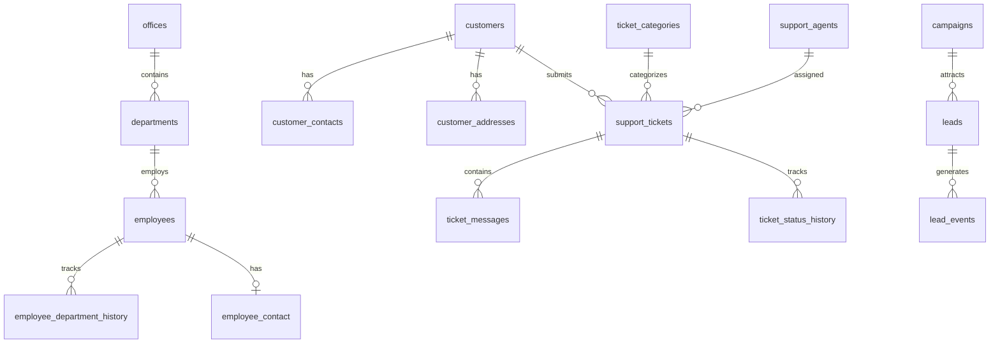
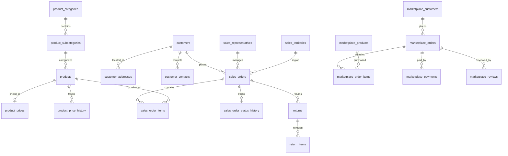
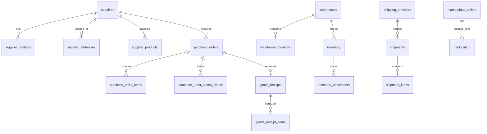

# Nexora Enterprise Dataset — Operational Database Relationship Map

This document outlines the internal entity relationships within each operational database (Cloudflare D1, Google Cloud AlloyDB, Aiven MySQL), explicitly illustrating how cross-database foreign keys are avoided.

---

## Architecture Principles

1. **Logical Independence**: Cloudflare D1, AlloyDB, and Aiven MySQL are independent source operational systems.
2. **No Cross-Database Foreign Keys**: Databases must NOT attempt `FOREIGN KEY (...) REFERENCES external_db.table(...)`.
3. **Downstream Integration**: Cross-system identity resolution (mapping application customers in D1 to ERP customers in AlloyDB or suppliers in Aiven) is performed downstream by PWA in BigQuery.

---

## 1. Cloudflare D1 (SQLite) — Internal ERD

---

## 2. Google Cloud AlloyDB (PostgreSQL) — Internal ERD

---

## 3. Aiven MySQL — Internal ERD

---

## 4. Olist Marketing to Marketplace Linking (Seller ID Provenance)

The relationship between marketing funnel activities in D1 and marketplace order transactions in AlloyDB / Aiven MySQL is linked explicitly via `seller_id`:

- **Cloudflare D1 (`lead_events`)**: `seller_id` (from `olist_closed_deals_dataset.csv`)
- **Aiven MySQL (`marketplace_sellers`)**: `seller_id` (from `olist_sellers_dataset.csv`)
- **AlloyDB (`marketplace_order_items`)**: `seller_id` (from `olist_order_items_dataset.csv`)

This preserved `seller_id` key allows downstream PWA BigQuery pipelines to trace marketing leads to completed marketplace orders across separate database engines.
