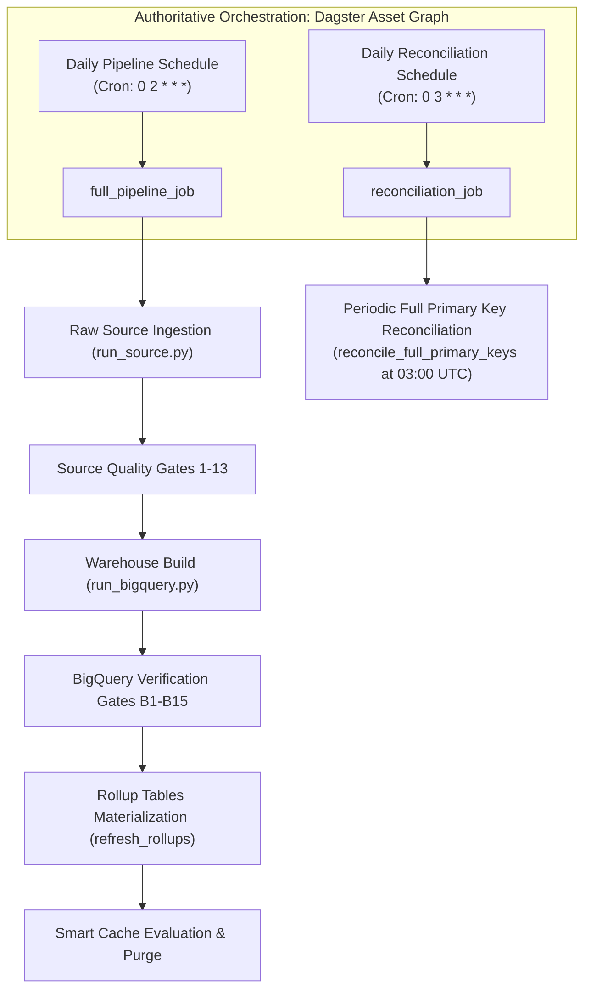

# ⏰ Automated Ingestion & Scheduling Operations Guide

This operations guide covers the scheduling, orchestration, execution monitoring, manual triggering, and failure alerting for the **Polyglot Warehouse Agent (PWA)** data platform.

---

## 🏗️ Architecture & Triggers

**Dagster** is the **single authoritative orchestration scheduler** for the PWA pipeline. All ingestion (`run_source.py`), warehouse build (`run_bigquery.py`), quality gate verifications, rollup materializations, and full PK reconciliation runs are governed by Dagster asset definitions and schedules (`src/pwa/orchestration/dagster_defs.py`).

No secondary or external schedulers (such as standalone cron, Airflow, or n8n) are required or supported.



---

## 1. Dagster Orchestration Graph (Authoritative Scheduler)

For asset lineage, transient retries, failure alerting, and UI monitoring, PWA defines its asset graph in [dagster_defs.py](file:///d:/Dakshin_learn/Personal_Projects/polyglot-warehouse-agent/src/pwa/orchestration/dagster_defs.py).

### Authoritative Schedules:
- **`daily_pipeline_schedule` (`0 2 * * *`):** Executes full ingestion -> quality gates -> warehouse build -> warehouse gates -> rollup refresh.
- **`daily_reconciliation_schedule` (`0 3 * * *`):** Executes full PK set reconciliation across operational databases to detect and purge deleted records.

> [!IMPORTANT]
> A `ScheduleDefinition` in Python code requires an active **Dagster Daemon** process watching it to fire ticks automatically.

### Running Dagster Locally & Docker Compose
To run locally with daemon + web UI:
```bash
dagster dev -m pwa.orchestration.dagster_defs -p 3000
```
Or via Docker Compose using the orchestration profile:
```bash
docker compose --profile orchestration up --build
```

### Deploying Dagster Daemon to Production
- **Dagster+ / Dagster Cloud (Recommended):** Deploy `dagster_defs.py` to Dagster Cloud with a serverless/hybrid agent.
- **Self-Hosted Container (Cloud Run Service / GKE):** Containerize `dagster-daemon run` and `dagster-webserver` as long-lived containers mounted with persistent storage or PostgreSQL DB backends.

---

## 🚨 Failure Alerting & Notification Sinks

PWA dispatches pipeline alerts through `default_alert_sinks()` defined in `pwa.observability.alerting`:

- **Slack (`PWA_SLACK_WEBHOOK_URL`):** Posts incoming webhook alert messages for `CRITICAL` / `HIGH` pipeline failures.
- **PagerDuty (`PWA_PAGERDUTY_ROUTING_KEY`):** Triggers PagerDuty incidents for unhandled batch failures.
- **LogAlertSink:** Emits structured JSON log events to standard log streams.

---

## 🎮 Manual Out-of-Band Triggers

To trigger an immediate data ingestion & warehouse build out-of-band:

### Via Local `pwa` CLI:
```bash
pwa source run && pwa warehouse run
```

